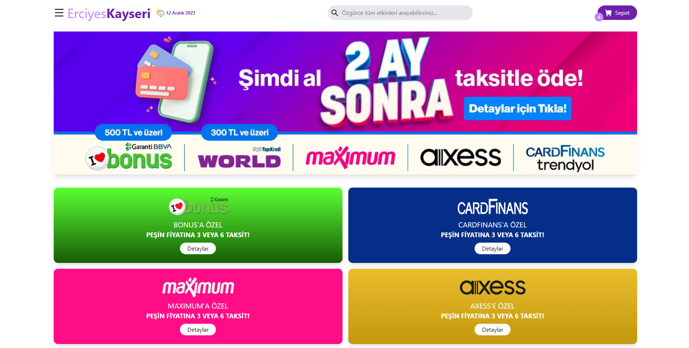

# Tech Career Erciyes Teknopark Bootcamp Bitirme Projesi

Bu proje, Türkiye ve dünyadaki gerçekleşecek olan konserleri, tiyatroları, spor faliyetlerini ve aklınıza gelebilecek bir çok etkinliği görebileceğiniz bir web uygulamasıdır. Sitemiz tüm teknolojik ekranlar için full responsive olarak kodlanmıştır. Sitemiz gerçekleşecek etkinlikleri tarihine, konumuna, fiyatına ve alanına göre filtreleyerek gösterebilir. Aynı zamanda dünyadaki tüm etkinliklerin günlük hava durumunu size meteorolojiden anlık olarak aldığı verilerle gösterebilir. Üstelik isterseniz bulunduğunuz konuma göre 4 günlük hava durumunu anlık olarak görebilirsiniz. Çok daha fazla özellik ve çok daha fazla etkinlik için sitemizi ziyaret edebilirsiniz.

## Kullanılan Teknolojiler
* React.JS = Kullanıcı arayüzleri oluşturmak için kullanılan bir Javascript kütüphanesi.
* Axios = Sunucuya istek yapmak için kullanılan promise tabanlı bir HTTP istemcisi. 
* React Router = Bir React uygulamasındaki farklı bileşenler arasında gezinme işlemleri için deklaratif bir yol.
* React Leaflet = Leaflet harita kütüphanesi için bir React sarmalayıcı.
* React Icon = React için icon kütüphanesi.
* Tailwind CSS = Uygulamanın kusursuz bir görünüşe ve full responsive yapıya sahip olması için kullanılan CSS framework'ü.
* Material UI = React tabanlı web uygulamaları geliştirmek için yaygın olarak kullanılan bir kütüphanedir.
* Enviroment (.env) = Çevresel değişkenleri saklamak ve yönetmek için kullanılan bir dosya türüdür.
* Weatherapi = Küresel hava durumu veritabanına gerçek zamanlı erişim.
* Html, Css, Js = Temel kullanım gereksinimleri.

### Sayfalar
* Ana sayfa = Bir çok temel detayı burada görebilirsiniz.
* Kampanyalar = Sitemizin ve çeşitli partnerlerin sizlere sunduğu kampanyaları görebilirsiniz.
* Siparişlerim = Tüm sepet ve sipariş işlemlerinizi burada görebilirsiniz. 
* Favorilerim = Favori etkinliklerinizi buradan yönetebilirsiniz.
* Biletlerim = Etkinlik biletlerinizi buradan görebilir konum ve tarih bilgilerini detaylı öğrenebilirsiniz.
* Hava Durumu = Bulunduğunuz şehir veya etkinlik konumuna göre biletinizi almadana önce ya da aldıktan sonra 4 günlük hava durumunu detaylı olarak arayabilirsiniz.
* S.S.S = Kafanıza takılan bir çok soruya cevap bulabilirsiniz.

### Site Kullanımı
* Ana sayfamız üzerinde sitemizin önerilen etkinliklerini, tüm etkinliklerini, en çok tercih edilen 3 etkinliği görebilirsiniz.
* Arama çubuklarında istediğiniz etkinlikleri, biletlerinizi, favorilerinizi vs. arayabilirsiniz.
* Detaylı ve pratik aramalar gerçekleşirebilmek için sayfalardaki filtreleme buttonlarını kullanabilirsiniz.
* Sol üst menu iconuna tıklayarak sidemenu üzerinden sitenin size sunduğu tüm sayfalara ulaşabilirsiniz.
* Hava durumu sekmesinden biletinizi almadan önce bulunduğunuz şehire göre veya etkinlik konumuna göre 4 günlük hava durumunu anlık olarak arayabilirsiniz.
* Siteye eklenen büyük yenilikler buraya eklenmeye devam edecektir.

### 27' Ekran Görüntüsüdür fakat sitemiz en küçük mobil cihazlar dahil full responsive yapıdadır.

